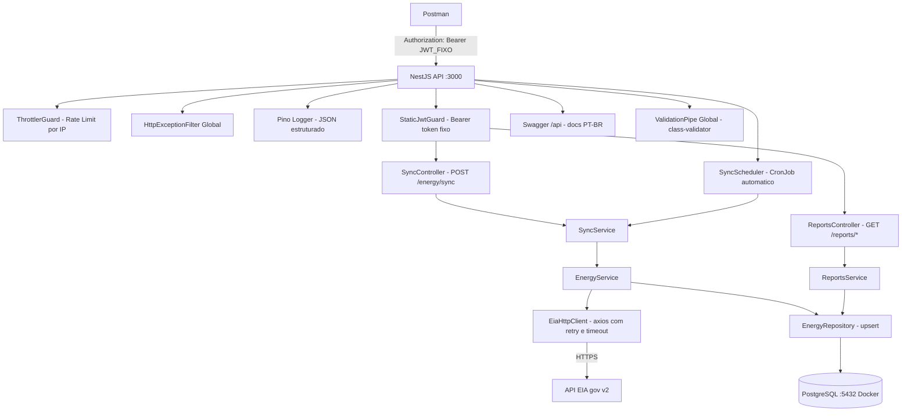
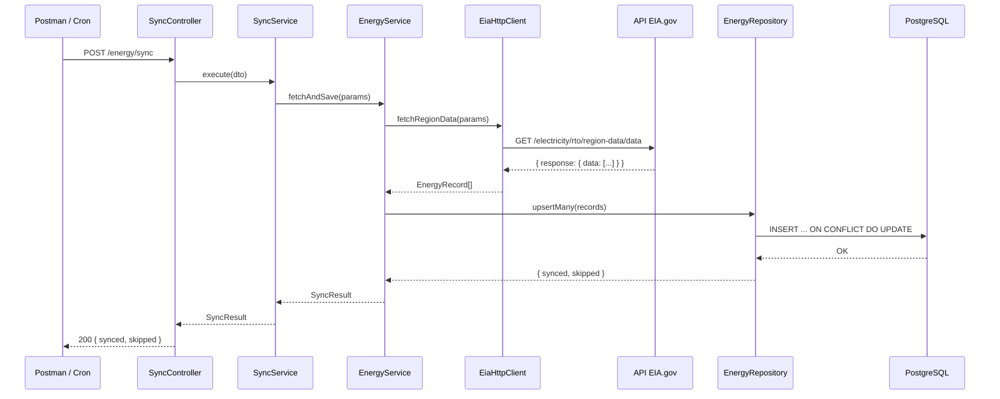

# Plano de Implementação — Enerdata API

**Data:** 01 de Abril de 2026
**Desafio:** Enermatch — Integração e Análise de Dados Energéticos
**Stack:** Node.js + TypeScript + NestJS + PostgreSQL + TypeORM + Docker

---

## Sumário

1. [Validação da Solicitação](#validação-da-solicitação)
2. [Arquitetura Geral](#arquitetura-geral)
3. [Estrutura de Pastas](#estrutura-de-pastas)
4. [Endpoints da API](#endpoints-da-api)
5. [Variáveis de Ambiente](#variáveis-de-ambiente)
6. [Stack Técnica Detalhada](#stack-técnica-detalhada)
7. [Lista de Tarefas](#lista-de-tarefas)
8. [Detalhamento de Cada Tarefa](#detalhamento-de-cada-tarefa)

---

## Validação da Solicitação

### Mapeamento: Desafio vs Implementação

| Requisito do Desafio | Coberto por |
|---|---|
| Integração com API EIA | `EiaHttpClient` + `SyncService` |
| Resiliência (timeout, network errors, retry) | Interceptors no `EiaHttpClient` + `EiaIntegrationException` |
| Persistência dos dados | PostgreSQL + TypeORM + `EnergyRepository` |
| Modelagem eficiente | Entidade `EnergyRecord` com índices compostos |
| API REST para relatórios | `ReportsController` com 4 endpoints |
| Docker (`docker-compose up`) | `docker-compose.yml` + `Dockerfile` multi-stage |
| Item 5 (comentários de IA) | **Ignorado** conforme solicitação |
| Item 6 | **Ignorado** conforme solicitação |

### Itens Adicionais Solicitados

| Item | Solução Técnica |
|---|---|
| JWT de chave fixa (token estático) | `StaticJwtGuard` valida `Authorization: Bearer <token>` contra `STATIC_JWT_SECRET` do `.env` |
| Rate limiting / Throttling | `@nestjs/throttler` com guard global configurado via `.env` |
| Logger Pino | `nestjs-pino` + `pino-http` com log JSON estruturado |
| SQL Injection protection | TypeORM QueryBuilder parameterizado + `class-validator` + `ValidationPipe` |
| Camada de Exceptions customizada | `AppException` base + subclasses específicas + `HttpExceptionFilter` global |
| `class-validator` + Pipes | `ValidationPipe` global com `whitelist`, `transform` e `class-transformer` |
| Prettier + ESLint | Configurados no setup inicial do projeto |
| Cron Job automático | `@nestjs/schedule` com cron expression configurável via `.env` |
| Endpoint manual de sync | `POST /energy/sync` disponível via Postman |
| Swagger PT-BR | `@nestjs/swagger` com descrições em português |
| Testes Jest | Unitários (services) + Integração (controllers) |
| Collection Postman | Arquivo `postman_collection.json` gerado ao final |

---

## Arquitetura Geral



---

## Estrutura de Pastas

```
src/
├── app.module.ts                        # Módulo raiz
├── main.ts                              # Bootstrap da aplicação
│
├── config/
│   └── configuration.ts                # Mapeamento e validação das variáveis de ambiente
│
├── database/
│   ├── database.module.ts              # TypeOrmModule.forRootAsync()
│   └── migrations/
│       └── YYYYMMDD-CreateEnergyRecords.ts
│
├── common/
│   ├── exceptions/
│   │   ├── app.exception.ts            # Classe base AppException extends HttpException
│   │   ├── eia-integration.exception.ts
│   │   ├── sync.exception.ts
│   │   ├── resource-not-found.exception.ts
│   │   └── http-exception.filter.ts   # Filtro global de exceções
│   ├── guards/
│   │   └── static-jwt.guard.ts        # Valida token estático do .env
│   ├── pipes/
│   │   └── validation.pipe.ts         # ValidationPipe configurado
│   └── interceptors/
│       └── logging.interceptor.ts     # Log de req/res via Pino
│
├── eia/
│   ├── eia.module.ts
│   ├── eia-http.client.ts             # Integração com API EIA v2
│   └── eia-response.interface.ts      # Tipos da resposta da EIA
│
├── energy/
│   ├── energy.module.ts
│   ├── energy.entity.ts               # Entidade TypeORM EnergyRecord
│   ├── energy.repository.ts           # Queries com QueryBuilder
│   ├── energy.service.ts              # Lógica de negócio e persistência
│   └── sync/
│       ├── sync.module.ts
│       ├── sync.controller.ts         # POST /energy/sync
│       ├── sync.service.ts            # Orquestra a coleta
│       └── sync.scheduler.ts          # CronJob com @Cron()
│
└── reports/
    ├── reports.module.ts
    ├── reports.controller.ts          # GET /reports/*
    ├── reports.service.ts             # Consultas de relatório
    └── dto/
        └── report-filter.dto.ts       # Filtros com class-validator
```

```
test/
├── unit/
│   ├── energy.service.spec.ts
│   ├── eia-http.client.spec.ts
│   └── reports.service.spec.ts
└── integration/
    ├── sync.controller.spec.ts
    └── reports.controller.spec.ts
```

---

## Endpoints da API

| Método | Rota | Auth | Descrição |
|--------|------|------|-----------|
| `POST` | `/energy/sync` | ✅ Bearer token | Dispara coleta manual dos dados da EIA |
| `GET` | `/reports/total` | ✅ Bearer token | Consumo total agrupado por período e região |
| `GET` | `/reports/average` | ✅ Bearer token | Média de consumo por período |
| `GET` | `/reports/peak` | ✅ Bearer token | Pico máximo de consumo registrado |
| `GET` | `/reports/by-region` | ✅ Bearer token | Dados agrupados por região RTO |
| `GET` | `/api` | ❌ Público | Swagger UI com documentação em PT-BR |

### Query Params comuns para os relatórios

| Parâmetro | Tipo | Obrigatório | Descrição |
|-----------|------|-------------|-----------|
| `start` | `string` (YYYY-MM-DDTHH) | Não | Data/hora de início do filtro |
| `end` | `string` (YYYY-MM-DDTHH) | Não | Data/hora de fim do filtro |
| `region` | `string` | Não | Código da região RTO (ex: `CAL`, `MIDA`) |
| `type` | `string` | Não | Tipo de dado (ex: `D`, `DF`, `NG`) |

---

## Variáveis de Ambiente

Arquivo `.env.example` a ser gerado na raiz do projeto:

```env
# ─── Aplicação ───────────────────────────────────────────────
PORT=3000
NODE_ENV=development

# ─── Autenticação (token fixo para uso no Postman) ───────────
# Enviar no header: Authorization: Bearer <valor abaixo>
STATIC_JWT_SECRET=meu_token_super_secreto_aqui

# ─── API EIA (https://www.eia.gov/opendata/) ─────────────────
EIA_API_KEY=sua_chave_da_eia_aqui
EIA_BASE_URL=https://api.eia.gov/v2
EIA_TIMEOUT_MS=10000
EIA_MAX_RETRIES=3

# ─── PostgreSQL ───────────────────────────────────────────────
DB_HOST=postgres
DB_PORT=5432
DB_USER=enerdata
DB_PASS=enerdata123
DB_NAME=enerdata

# ─── Cron de Sincronização ───────────────────────────────────
# Formato cron: segundo minuto hora dia mês dia_da_semana
# Padrão: a cada 1 hora
SYNC_CRON_EXPRESSION=0 * * * *

# ─── Rate Limiting ────────────────────────────────────────────
# THROTTLE_TTL: janela de tempo em segundos
# THROTTLE_LIMIT: máximo de requisições na janela
THROTTLE_TTL=60
THROTTLE_LIMIT=30
```

---

## Stack Técnica Detalhada

### Dependências Principais

| Pacote | Versão | Uso |
|--------|--------|-----|
| `@nestjs/core` | ^10.x | Framework principal |
| `@nestjs/config` | ^3.x | Gerenciamento de variáveis de ambiente |
| `@nestjs/typeorm` | ^10.x | Integração TypeORM |
| `typeorm` | ^0.3.x | ORM para PostgreSQL |
| `pg` | ^8.x | Driver PostgreSQL |
| `@nestjs/axios` | ^3.x | Cliente HTTP para integração com EIA |
| `@nestjs/schedule` | ^4.x | CronJob para sincronização automática |
| `@nestjs/throttler` | ^5.x | Rate limiting |
| `@nestjs/swagger` | ^7.x | Documentação Swagger |
| `nestjs-pino` | ^4.x | Logger baseado em Pino |
| `pino-http` | ^9.x | Middleware HTTP para logging |
| `class-validator` | ^0.14.x | Validação de DTOs |
| `class-transformer` | ^0.5.x | Transformação de dados |
| `zod` | ^3.x | Validação do schema do `.env` e tipagem em runtime |

### Dependências de Desenvolvimento

| Pacote | Uso |
|--------|-----|
| `@nestjs/testing` | Utilities de teste |
| `jest` | Framework de testes |
| `supertest` | Testes HTTP de integração |
| `typescript` | Compilador TypeScript |
| `eslint` | Linting |
| `prettier` | Formatação de código |
| `pino-pretty` | Formatação de logs em desenvolvimento |

---

## Entidade `EnergyRecord`

Dados do endpoint `electricity/rto/region-data` da EIA (dados horários por região RTO):

```
energy_records
├── id            UUID        PK
├── period        VARCHAR     NOT NULL  (ex: "2026-03-01T00-03:00")
├── respondent    VARCHAR     NOT NULL  (código da região, ex: "CAL")
├── respondentName VARCHAR    NOT NULL  (nome da região, ex: "California ISO")
├── type          VARCHAR     NOT NULL  (ex: "D" = demand, "NG" = net generation)
├── typeDescription VARCHAR   NOT NULL
├── value         DECIMAL     NULLABLE  (valor em MWh)
├── unit          VARCHAR     NOT NULL  (ex: "megawatthours")
├── createdAt     TIMESTAMP   DEFAULT NOW()
├── updatedAt     TIMESTAMP   DEFAULT NOW()
│
├── INDEX: idx_energy_period (period)
├── INDEX: idx_energy_respondent (respondent)
├── INDEX: idx_energy_period_respondent (period, respondent)
└── UNIQUE: uq_energy_period_respondent_type (period, respondent, type)
```

---

## Lista de Tarefas

| # | Tarefa | Categoria |
|---|--------|-----------|
| TASK-01 | Inicializar projeto NestJS com TypeScript, configurar Prettier e ESLint | Setup |
| TASK-02 | Configurar estrutura de pastas e módulos base do NestJS | Setup |
| TASK-03 | Configurar variáveis de ambiente com `@nestjs/config` e arquivo `.env.example` | Config |
| TASK-04 | Criar `docker-compose.yml` com PostgreSQL e aplicação NestJS | Infra |
| TASK-05 | Criar `Dockerfile` multi-stage para a aplicação NestJS | Infra |
| TASK-06 | Configurar TypeORM com conexão ao PostgreSQL | Database |
| TASK-07 | Criar entidade `EnergyRecord` com TypeORM decorators e índices | Database |
| TASK-08 | Criar migration inicial da tabela `energy_records` | Database |
| TASK-09 | Implementar camada customizada de Exceptions | Common |
| TASK-10 | Configurar Pino logger como logger global | Common |
| TASK-11 | Configurar `ThrottlerModule` para rate limiting global | Common |
| TASK-12 | Implementar `StaticJwtGuard` para autenticação via token fixo | Auth |
| TASK-13 | Configurar `ValidationPipe` global com `class-transformer` | Common |
| TASK-14 | Criar `EiaHttpClient` com interceptors de timeout, retry e tratamento de erros | Integração |
| TASK-15 | Criar `EnergyRepository` com upsert e QueryBuilder parameterizado | Database |
| TASK-16 | Implementar `EnergyService` com lógica de processamento e persistência | Business |
| TASK-17 | Implementar `SyncModule` com `POST /energy/sync` + `SyncScheduler` CronJob | Sync |
| TASK-18 | Criar `ReportsModule` com endpoints `GET /reports/*` | Reports |
| TASK-19 | Criar DTOs com `class-validator` para os filtros dos relatórios | Reports |
| TASK-20 | Garantir proteção contra SQL Injection em todos os repositories | Security |
| TASK-21 | Aplicar `StaticJwtGuard` nos endpoints protegidos | Auth |
| TASK-22 | Configurar Swagger com `@nestjs/swagger` com documentação em PT-BR | Docs |
| TASK-23 | Implementar testes unitários Jest para Services | Testes |
| TASK-24 | Implementar testes de integração Jest para Controllers | Testes |
| TASK-25 | Gerar arquivo `postman_collection.json` com todos os endpoints | Postman |
| TASK-26 | Criar `README.md` em PT-BR com instruções de setup e uso | Docs |

---

## Detalhamento de Cada Tarefa

### TASK-01 — Inicialização do Projeto

**Ações:**
- Executar `nest new enerdata-api --package-manager npm`
- Configurar `tsconfig.json` com `strict: true`
- Configurar `.eslintrc.js` com regras NestJS + TypeScript
- Configurar `.prettierrc` (singleQuote, trailingComma, printWidth 100)
- Adicionar scripts no `package.json`: `start:dev`, `start:prod`, `migration:run`, `migration:generate`, `test`, `test:cov`

---

### TASK-02 — Estrutura de Módulos Base

**Ações:**
- Criar estrutura de pastas conforme definida acima
- Configurar `AppModule` importando todos os módulos globais
- Garantir que o `ConfigModule` seja global (`isGlobal: true`)

---

### TASK-03 — Variáveis de Ambiente

**Ações:**
- Instalar `@nestjs/config` e `zod`
- Criar `src/config/configuration.ts` com mapeamento e validação do schema via `Zod`
- Usar o `validate` option do `ConfigModule.forRoot()` passando o schema Zod
- Criar `.env.example` com todos os campos documentados
- Criar `.env` local (ignorado no `.gitignore`)

**Validação com Zod:**
```typescript
import { z } from 'zod';

const envSchema = z.object({
  PORT: z.coerce.number().default(3000),
  NODE_ENV: z.enum(['development', 'production', 'test']).default('development'),
  STATIC_JWT_SECRET: z.string().min(1),
  EIA_API_KEY: z.string().min(1),
  EIA_BASE_URL: z.string().url().default('https://api.eia.gov/v2'),
  EIA_TIMEOUT_MS: z.coerce.number().default(10000),
  EIA_MAX_RETRIES: z.coerce.number().default(3),
  DB_HOST: z.string().default('postgres'),
  DB_PORT: z.coerce.number().default(5432),
  DB_USER: z.string().min(1),
  DB_PASS: z.string().min(1),
  DB_NAME: z.string().min(1),
  SYNC_CRON_EXPRESSION: z.string().default('0 * * * *'),
  THROTTLE_TTL: z.coerce.number().default(60),
  THROTTLE_LIMIT: z.coerce.number().default(30),
});

export type EnvConfig = z.infer<typeof envSchema>;

export function validate(config: Record<string, unknown>): EnvConfig {
  const result = envSchema.safeParse(config);
  if (!result.success) {
    throw new Error(`Configuração inválida: ${result.error.message}`);
  }
  return result.data;
}
```

---

### TASK-04 — docker-compose.yml

**Ações:**
- Serviço `postgres`: imagem `postgres:16-alpine`, volume persistente, healthcheck
- Serviço `app`: build a partir do Dockerfile, `depends_on: postgres`, porta `3000:3000`
- Network interna para comunicação entre serviços
- Arquivo `.dockerignore` para otimizar build

```yaml
services:
  postgres:
    image: postgres:16-alpine
    environment:
      POSTGRES_USER: enerdata
      POSTGRES_PASSWORD: enerdata123
      POSTGRES_DB: enerdata
    volumes:
      - pgdata:/var/lib/postgresql/data
    healthcheck:
      test: ["CMD-SHELL", "pg_isready -U enerdata"]
      interval: 5s
      timeout: 5s
      retries: 5

  app:
    build: .
    ports:
      - "3000:3000"
    environment:
      DB_HOST: postgres
    depends_on:
      postgres:
        condition: service_healthy

volumes:
  pgdata:
```

---

### TASK-05 — Dockerfile Multi-Stage

```dockerfile
# Stage 1: Build
FROM node:20-alpine AS builder
WORKDIR /app
COPY package*.json ./
RUN npm ci
COPY . .
RUN npm run build

# Stage 2: Production
FROM node:20-alpine AS runner
WORKDIR /app
COPY package*.json ./
RUN npm ci --omit=dev
COPY --from=builder /app/dist ./dist
CMD ["node", "dist/main.js"]
```

---

### TASK-06 — Configuração TypeORM

**Ações:**
- Instalar `typeorm`, `@nestjs/typeorm`, `pg`
- Criar `DatabaseModule` com `TypeOrmModule.forRootAsync()`
- Configurar `synchronize: false` (usar migrations)
- Configurar `migrationsRun: true`
- Configurar `migrationsTableName: 'migrations'`

---

### TASK-07 — Entidade EnergyRecord

**Ações:**
- Criar `src/energy/energy.entity.ts`
- Usar `@Entity('energy_records')`
- Decorators: `@PrimaryGeneratedColumn('uuid')`, `@Column()`, `@Index()`, `@Unique()`
- Campos conforme especificado na seção de modelagem
- Adicionar `@CreateDateColumn()` e `@UpdateDateColumn()`

---

### TASK-08 — Migration Inicial

**Ações:**
- Gerar migration com `npm run migration:generate`
- Verificar SQL gerado: `CREATE TABLE energy_records (...)`
- Constraint `UNIQUE(period, respondent, type)` para evitar duplicatas
- Índices em `period`, `respondent` e `(period, respondent)`

---

### TASK-09 — Camada de Exceptions

**Estrutura:**
```typescript
// app.exception.ts
class AppException extends HttpException {
  constructor(message: string, status: HttpStatus, public readonly details?: unknown)
}

// eia-integration.exception.ts
class EiaIntegrationException extends AppException {
  constructor(cause?: Error)
}

// http-exception.filter.ts - resposta padrão:
{
  statusCode: number,
  message: string,
  timestamp: string,
  path: string,
  details?: unknown
}
```

---

### TASK-10 — Pino Logger

**Ações:**
- Instalar `nestjs-pino`, `pino-http`, `pino-pretty` (dev)
- Configurar `LoggerModule.forRootAsync()` no `AppModule`
- Em `development`: usar `pino-pretty` para logs legíveis
- Em `production`: logs em JSON puro
- Configurar `pinoHttp` para logar request/response automaticamente

---

### TASK-11 — ThrottlerModule

**Ações:**
- Instalar `@nestjs/throttler`
- Configurar `ThrottlerModule.forRootAsync()` com valores do `.env`
- Aplicar `APP_GUARD` global com `ThrottlerGuard`
- Customizar mensagem de erro quando rate limit é excedido via Exception Filter

---

### TASK-12 — StaticJwtGuard

**Funcionamento:**
1. Extrai o token do header `Authorization: Bearer <token>`
2. Compara com o valor de `STATIC_JWT_SECRET` do `.env`
3. Se divergir → lança `UnauthorizedException`
4. Se igual → permite prosseguir

> **Para usar no Postman:** Configure o header `Authorization` com o valor `Bearer <STATIC_JWT_SECRET>`

---

### TASK-13 — ValidationPipe Global

**Configuração no `main.ts`:**
```typescript
app.useGlobalPipes(new ValidationPipe({
  whitelist: true,           // Remove campos não declarados no DTO
  forbidNonWhitelisted: true, // Rejeita requests com campos extras
  transform: true,           // Converte tipos automaticamente
  transformOptions: {
    enableImplicitConversion: true,
  },
}));
```

---

### TASK-14 — EiaHttpClient

**Ações:**
- Instalar `@nestjs/axios`, `axios`
- Configurar `HttpModule.registerAsync()` com `baseURL` e `timeout` do `.env`
- Implementar retry automático (até 3 tentativas) com delay exponencial
- Capturar `AxiosError` e converter em `EiaIntegrationException`
- Método principal: `fetchRegionData(params: EiaQueryParams): Promise<EiaResponse>`
- Endpoint alvo: `GET /electricity/rto/region-data/data?api_key=...&data[]=value&frequency=local-hourly&...`

---

### TASK-15 — EnergyRepository

**Métodos:**
- `upsertMany(records: Partial<EnergyRecord>[]): Promise<void>` — usa `onConflict`
- `findWithFilters(filters: ReportFilterDto): Promise<EnergyRecord[]>`
- `getTotalConsumption(filters: ReportFilterDto): Promise<{ total: number, unit: string }>`
- `getAverageConsumption(filters: ReportFilterDto): Promise<{ average: number }>`
- `getPeakConsumption(filters: ReportFilterDto): Promise<EnergyRecord>`
- `getByRegion(filters: ReportFilterDto): Promise<RegionSummary[]>`

> **Segurança:** Todos os parâmetros dinâmicos usam `.setParameter()` no QueryBuilder

---

### TASK-16 — EnergyService

**Responsabilidades:**
1. Receber dados brutos da resposta da EIA
2. Mapear para o formato da entidade `EnergyRecord`
3. Chamar `EnergyRepository.upsertMany()` em batches de 500 registros
4. Retornar sumário: `{ synced: number, skipped: number }`

---

### TASK-17 — SyncModule

**SyncController (`POST /energy/sync`):**
```typescript
@Post('sync')
@UseGuards(StaticJwtGuard)
async sync(@Body() dto: SyncRequestDto) {
  return this.syncService.execute(dto);
}
```

**SyncScheduler:**
```typescript
@Cron(process.env.SYNC_CRON_EXPRESSION)
async handleCron() {
  await this.syncService.execute({});
}
```

**SyncRequestDto (opcional, permite sobrescrever período):**
- `start?: string` — data início (padrão: 30 dias atrás)
- `end?: string` — data fim (padrão: hoje)
- `regions?: string[]` — lista de regiões (padrão: todas)

---

### TASK-18 — ReportsModule

**Endpoints:**

```
GET /reports/total?start=&end=&region=&type=
  → { total: number, unit: string, period: { start, end }, region }

GET /reports/average?start=&end=&region=&type=
  → { average: number, unit: string, sampleCount: number }

GET /reports/peak?start=&end=&region=&type=
  → { peak: number, unit: string, period: string, region: string }

GET /reports/by-region?start=&end=&type=
  → [{ region, regionName, total, average, peak, dataPoints }]
```

---

### TASK-19 — ReportFilterDto

```typescript
class ReportFilterDto {
  @IsOptional()
  @IsDateString()
  start?: string;

  @IsOptional()
  @IsDateString()
  end?: string;

  @IsOptional()
  @IsString()
  region?: string;

  @IsOptional()
  @IsString()
  type?: string;
}
```

---

### TASK-20 — Proteção contra SQL Injection

**Checklist:**
- [ ] `EnergyRepository` usa apenas QueryBuilder com `.setParameter()`
- [ ] Nenhuma concatenação de string em queries SQL
- [ ] `ValidationPipe` com `whitelist: true` rejeita campos não declarados
- [ ] `@IsString()` e `@Matches()` nos DTOs validam formato dos inputs
- [ ] TypeORM driver `pg` usa prepared statements por padrão

---

### TASK-21 — Aplicação do AuthGuard

**Estratégia:**
- Aplicar `@UseGuards(StaticJwtGuard)` nos controllers: `SyncController` e `ReportsController`
- Configurar `SwaggerModule` para mostrar o cadeado de autenticação nos endpoints protegidos

---

### TASK-22 — Swagger em PT-BR

**Configuração:**
```typescript
const config = new DocumentBuilder()
  .setTitle('Enerdata API')
  .setDescription('API de integração e análise de dados energéticos da EIA')
  .setVersion('1.0')
  .addBearerAuth()
  .build();
```

**Decorators em PT-BR nos controllers:**
- `@ApiOperation({ summary: 'Sincronizar dados da EIA' })`
- `@ApiResponse({ status: 200, description: 'Sincronização realizada com sucesso' })`
- `@ApiQuery({ name: 'start', description: 'Data de início no formato ISO 8601' })`

---

### TASK-23 — Testes Unitários Jest

**Arquivos:**
- `test/unit/energy.service.spec.ts` — mockar `EiaHttpClient` e `EnergyRepository`
- `test/unit/eia-http.client.spec.ts` — mockar `HttpService`, testar retry e tratamento de erros
- `test/unit/reports.service.spec.ts` — mockar `EnergyRepository`, testar cálculos

**Cobertura mínima esperada:** 70%

---

### TASK-24 — Testes de Integração Jest

**Arquivos:**
- `test/integration/sync.controller.spec.ts` — usar `Test.createTestingModule()`, mockar `SyncService`
- `test/integration/reports.controller.spec.ts` — usar `supertest`, mockar `ReportsService`

---

### TASK-25 — Collection Postman

**Arquivo:** `postman_collection.json` na raiz do projeto

**Estrutura da collection:**
```
Enerdata API
├── 🔒 Sync
│   └── POST Sincronizar Dados da EIA
├── 🔒 Relatórios
│   ├── GET Consumo Total
│   ├── GET Média de Consumo
│   ├── GET Pico de Consumo
│   └── GET Consumo por Região
└── 📖 Documentação
    └── GET Swagger UI
```

**Variáveis de ambiente Postman:**
- `base_url`: `http://localhost:3000`
- `auth_token`: `<valor do STATIC_JWT_SECRET>`

---

### TASK-26 — README.md em PT-BR

**Seções:**
1. Sobre o projeto
2. Pré-requisitos
3. Como obter a chave da API EIA
4. Configuração do ambiente (`.env`)
5. Executando com Docker (`docker-compose up`)
6. Executando localmente (sem Docker)
7. Executando testes
8. Endpoints disponíveis
9. Importando a Collection no Postman
10. Estrutura do projeto

---

## Diagrama de Fluxo da Sincronização



---

## Status de Implementação

### ✅ Tarefas Concluídas

| # | Tarefa | Status | Arquivos |
|---|--------|--------|----------|
| TASK-01 | Inicialização do Projeto | ✅ Completo | `package.json`, `tsconfig.json`, `.eslintrc.js`, `.prettierrc` |
| TASK-02 | Estrutura de Módulos Base | ✅ Completo | `src/app.module.ts`, `src/main.ts` |
| TASK-03 | Variáveis de Ambiente | ✅ Completo | `src/config/env.schema.ts`, `.env.example` |
| TASK-04 | docker-compose.yml | ✅ Completo | `docker-compose.yml` |
| TASK-05 | Dockerfile Multi-Stage | ✅ Completo | `Dockerfile` |
| TASK-06 | Configuração TypeORM | ✅ Completo | `src/database/database.module.ts`, `typeorm.config.ts` |
| TASK-07 | Entidade EnergyRecord | ✅ Completo | `src/energy/energy.entity.ts` |
| TASK-08 | Migration Inicial | ✅ Completo | `src/database/migrations/1743471000000-CreateEnergyRecordsTable.ts` |
| TASK-09 | Camada de Exceptions | ✅ Completo | `src/common/exceptions/app.exception.ts` |
| TASK-10 | Pino Logger | ✅ Completo | Configurado em `app.module.ts` |
| TASK-11 | ThrottlerModule | ✅ Completo | Configurado em `app.module.ts` |
| TASK-12 | StaticJwtGuard | ✅ Completo | `src/common/guards/static-jwt.guard.ts` |
| TASK-13 | ValidationPipe Global | ✅ Completo | Configurado em `main.ts` |
| TASK-14 | EiaHttpClient | ✅ Completo | `src/eia/eia-http.client.ts` |
| TASK-15 | EnergyRepository | ✅ Completo | `src/energy/energy.repository.ts` |
| TASK-16 | EnergyService | ✅ Completo | `src/energy/energy.service.ts` |
| TASK-17 | SyncModule | ✅ Completo | `src/energy/sync/sync.controller.ts`, `sync.scheduler.ts` |
| TASK-18 | ReportsModule | ✅ Completo | `src/reports/reports.controller.ts`, `reports.service.ts` |
| TASK-19 | ReportFilterDto | ✅ Completo | `src/reports/dto/report-filter.dto.ts` |
| TASK-20 | Proteção SQL Injection | ✅ Completo | QueryBuilder com parâmetros |
| TASK-21 | Aplicação do AuthGuard | ✅ Completo | Controllers com `@UseGuards` |
| TASK-22 | Swagger em PT-BR | ✅ Completo | Documentação nos controllers |
| TASK-23 | Testes Unitários Jest | ✅ Completo | Ver tabela de testes abaixo |
| TASK-24 | Testes de Integração Jest | ✅ Completo | Ver tabela de testes abaixo |
| TASK-25 | Collection Postman | ✅ Completo | `docs/postman_collection.json` |
| TASK-26 | README.md | ✅ Completo | `README.md` |

### Cobertura de Testes

| Suite de Testes | Cenários | Status |
|-----------------|----------|--------|
| `energy.service.spec.ts` | 8 (sync com sucesso, múltiplos registros, parâmetros, dados vazios, erros de API, erros de BD, erros desconhecidos) | ✅ |
| `energy.repository.spec.ts` | 11 (upsertRecords, filtros, consultas de relatório) | ✅ |
| `eia-http.client.spec.ts` | 7 (sucesso, parâmetros, erros de rede, erros Axios) | ✅ |
| `sync.controller.spec.ts` | 4 (sync com/sem parâmetros, erro, resultado) | ✅ |
| `reports.service.spec.ts` | 8 (total, média, pico, por região, edge cases) | ✅ |
| `reports.controller.spec.ts` | 8 (endpoints com filtros e sem filtros) | ✅ |
| `app.controller.spec.ts` | 1 | ✅ |

**Total: 47 testes unitários, 100% das suites passando**

### Cobertura de Código (após testes)

| Componente | Cobertura Stmts | Cobertura Funcs | Cobertura Lines |
|------------|-----------------|-----------------|-----------------|
| `src/energy/*` | 87.83% | 100% | 89.23% |
| `src/reports/*` | 79.41% | 100% | 82.14% |
| `src/eia/*` | 75% | 66.66% | 78.57% |
| **Total** | **53.72%** | **71.42%** | **53.7%** |

---

*Plano gerado em 01/04/2026*
*Última atualização: 01/04/2026 - Testes unitários implementados*
